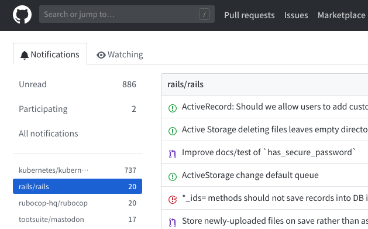
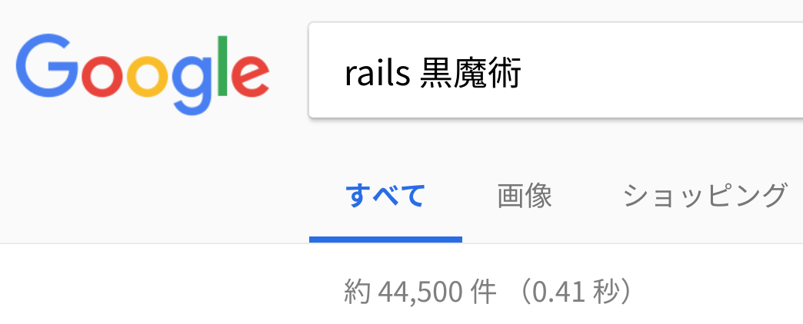
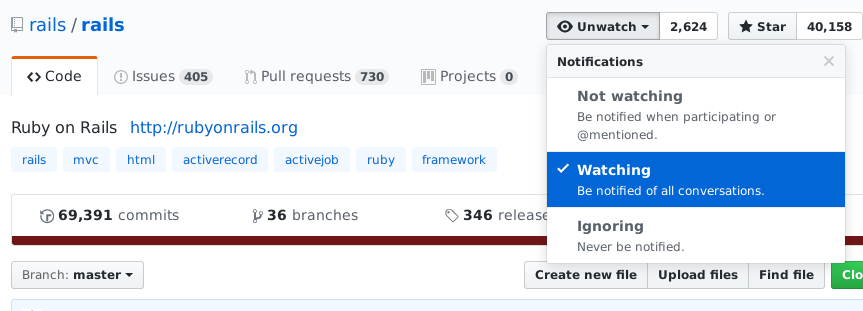
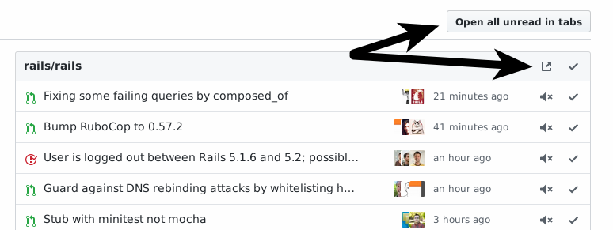
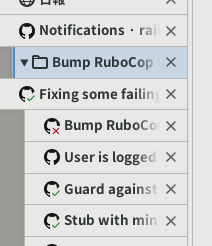

# Railsのissueを毎日読む方法
subtitle
: 2018-07-14 株式会社ドリコム

subtitle
: Rails Developers Meetup 2018 Day 3 Extreme

author
: うなすけ

theme
: unasuke-white

# 自己紹介
- 名前 : うなすけ
- 所属 : 株式会社バンク (エンジニア)
  - インフラ寄りサーバーサイドエンジニア
  - 業界4年目
- GitHub [@unasuke](https://github.com/unasuke)
- Twitter [@yu\_suke1994](https://twitter.com/yu_suke1994)
- Mastodon [@unasuke@mstdn.maud.io](https://mstdn.maud.io/@unasuke)

{:relative_width="24" align="right" relative_margin_right="-10" relative_margin_top="42"}

# ちょっと宣伝
{:relative_width="100"}

# ちょっと宣伝
{:relative_width="100"}

# ちょっと宣伝
{:relative_width="100"}

# OSS watch
{:relative_width="90"}

# もくじ
1. なぜOSSをwatchするのか
1. どのようにwatchするか
1. まとめ

# もくじ
1. なぜOSSをwatchするのか ←
    1. Railsをwatchする理由
    1. Mastodonをwatchする理由
    1. [任意]をwatchする理由
1. どのようにwatchするか
1. まとめ

# なぜOSSをwatchするのか

* なぜ？
  * メンテナでもないのに？
  * 頼まれたわけでもないのに？
  * お金が貰えるわけでもないのに？

# なぜRailsをwatchするのか
- Railsを使ってる人はどのくらいここにいますか？
  - 仕事で
  - 個人で
  - 両方

# なぜRailsをwatchするのか
{:relative_width="100"}

{:.center}
{::tag name="x-large"}Rails 黒魔術 ➡️ 44,500件{:/tag}

# なぜRailsをwatchするのか
> 十分に発達した科学技術は、魔法と見分けがつかない。

[https://ja.wikipedia.org/wiki/クラークの三法則](https://ja.wikipedia.org/wiki/%E3%82%AF%E3%83%A9%E3%83%BC%E3%82%AF%E3%81%AE%E4%B8%89%E6%B3%95%E5%89%87)

{:.center}
{::tag name="xx-large"}Railsは魔術ではなく、技術{:/tag}

{:.center}
{::tag name="x-large"}↓{:/tag}

{:.center}
{::tag name="xx-large"}読めばわかる{:/tag}

{:.right}
{::tag name="x-small"}理解できるとは言ってない……{:/tag}

# Railsをwatchする理由
- Railsは魔術じゃなくて技術
  - アプリと地続き
- 次リリースの予習
  - 新機能のキャッチアップ
  - updateが楽になる(かも？)
- 同じ轍を踏まない
  - issueでbugの先取り
    - 稀

# Mastodonをwatchする理由
- ソースコードが読めるSNSなので
  - もしTwitterのコードが読めたら読むでしょ？！
    - 理解できなくても読みたい……
- Rails appの実装の参考として
  - RedmineやGitLabやfastladderも同様
- いずれ運用するので
  - 僕が

# [任意]をwatchする理由
- 自分が使用しているツールのコードを追う
  - 新リリース
  - bug fix
  - そもそも活発？
- 書けるようになるために、それ以上に読む
- あわよくばコントリチャンス？

# 大事なこと

{::tag name="center"}
{::tag name="x-large"}Diffだけ読んでも理解はできない{:/tag}
{:/tag}

# Diffだけ読んでも理解はできない
- issueやpull reqはコードリーディングのとっかかり
  - 本体のコードも読みに行く
  - 数行のdiffを入口に数百行のコードを追う
    - ローカルへのcloneはほぼ必須
    - [amatsuda/gem-src](https://github.com/amatsuda/gem-src)

# もくじ
1. なぜOSSをwatchするのか
    1. Railsをwatchする理由
    1. Mastodonをwatchする理由
    1. [任意]をwatchする理由
1. どのようにwatchするか ←
1. まとめ

# もくじ
1. なぜOSSをwatchするのか
1. どのようにwatchするか ←
    1. コツ
    1. (僕の)やり方
1. まとめ

# どのようにwatchするか - コツ
1. 全てを理解しようとしない
1. 何かしら感想を書く
1. 義務と思わない
1. 時間を決めてやる

# どのようにwatchするか - コツ
- 全てを理解しようとしない
    - diffだけ読んでも理解はできない
    - あなたはメンテナではない
      - 何の責任もない
    - そんな時間はない
      - やりたいことはいくらでもある
    - でも、理解しようという心掛けはする
      - たとえば再現手順を実行してみるとか

# どのようにwatchするか - コツ
- 何かしら感想を書く
  - 感想を言語化する
    - 会社の日報でもブログでも
    - 「話す」でもいいのかも
  - 読むだけだと「ふ〜ん」で終わりがち
    - 書くことで自分の理解がわかる

# どのようにwatchするか - コツ
- 義務と思わない
  - あなたはメンテナではない
  - 「義務感」では長続きしない
    - 自発的にやることが大事
  - 「いつでもやめられる」という気持ちで
  - 楽しさや好奇心が大事

# どのようにwatchするか - コツ
- 時間を決めてやる
  - 14時から読む、など
  - アラームを設定しておく
    - 鳴る前にやる
  - Railsをwatchするくらいは業務内容
    - に、してもいいよね？

# どのようにwatchするか - コツ
1. 全てを理解しようとしない
1. 何かしら感想を書く
1. 義務と思わない
1. 時間を決めてやる

# もくじ
1. なぜOSSをwatchするのか
1. どのようにwatchするか
    1. コツ
    1. (僕の)やり方 ←
1. まとめ

# どのようにwatchするか

{:.center}
そもそも「watch」できてますか？

{:relative_width="100"}

# どのようにwatchするか - (僕の)やり方
- Firefoxを使う
  - タブを大量に開いたときの動作が安定している(主観)
    - Chrome系と比較して

{:relative_width="30" align="right" relative_margin_right="-10" relative_margin_top="38"}

# どのようにwatchするか - (僕の)やり方
- refined-githubを使う
  - [https://github.com/sindresorhus/refined-github](https://github.com/sindresorhus/refined-github)
  - ブラウザ拡張
  - issueを一気に開くことができる

{:relative_width="65"}

{:relative_width="15" align="right" relative_margin_right="-3" relative_margin_top="38"}

# どのようにwatchするか - (僕の)やり方
- tree-style-tabを使う
  - [https://addons.mozilla.org/ja/firefox/addon/tree-style-tab/](https://addons.mozilla.org/ja/firefox/addon/tree-style-tab/)
  - ブラウザ拡張
  - 大量のタブの視認性がよくなる

{:relative_width="20"}

# どのようにwatchするか - (僕の)やり方
- issueを全部開く
  - rails/railsなら1日にだいたい20〜30
  - tootsuite/mastodonなら1日にだいたい10〜20
  - rubocop-hq/rubocopなら1日にだいたい5〜15
  - (kubernetes/kubernetesなら1日にだいたい200〜400)

# どのようにwatchするか - (僕の)やり方
- 上から読んでいく
  - 30秒くらい読んでわからなかったら閉じる
    - 時間は有限
  - 興味のある分野ならもうすこし頑張って理解してみる
    - それでも1、2分くらい？
  - 完璧な理解じゃなくていいから感想を書く
    - 1、2文くらいでいい
    - 言語化が大事

# どのようにwatchするか - (僕の)やり方
- ヤギヌマ新聞を読む
  - [http://y-yagi.hatenablog.com/](http://y-yagi.hatenablog.com/)
  - 自分の理解が正しかったかどうか
    - rails/rails しかできないけど……

# どのようにwatchするか - (僕の)やり方
- を、毎日やる
  - 時間を空けると溜まって億劫になる
  - 習慣付ける
    - 「あ、今日読んでない」と思えるように
- 何なら読むだけの日があってもいい
  - 趣味だし
- 何なら読まない日があってもいい
  - 趣味だし

# もくじ
1. なぜOSSをwatchするのか
1. どのようにwatchするか
1. まとめ ←

# まとめ
- 書けるようになるために読む
- 全てを理解しようとしない、しなくてもいい
- 毎日読んで習慣付ける
  - 継続は力なり
- 義務感でなく、軽い気持ちで
- OSS watchを楽しもう！
  - rails/railsに限らず
